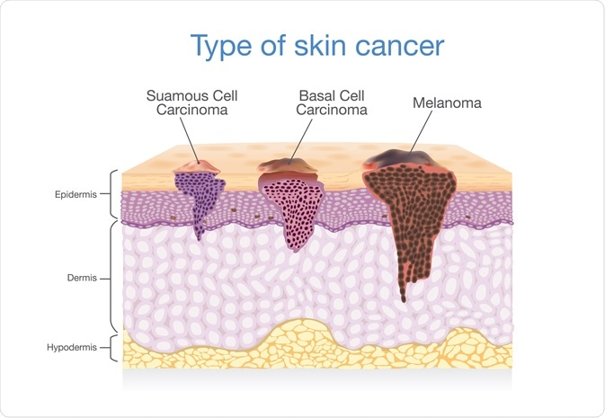

 <h1> Skin Lesion Identification Using Deep Learning </h1> 

# Abstract
Skin cancer is defined as the uncontrolled growth of abnormal cells in the epidermis, the skin's outermost layer, caused by unrepaired DNA damage that results in mutations. Skin cancer is one of the most frequent types of cancer in the globe. The three most frequent types of skin cancer are squamous cell carcinoma, basal cell carcinoma, and melanoma. The clinical therapy of a skin lesion is mostly determined by its prompt discovery. The prevalence of skin cancer is on the rise, particularly melanoma, which is aggressive due to its high metastatic rate. As a result, early detection is crucial for therapy before the beginning of malignancy. To overcome this issue, medical imaging is employed for dermoscopic image processing and classification/identification. This gives an opportunity to create an automated model for identifying skin lesions. Using Convolutional Neural Networks, we investigated an automated technique for lesion diagnosis (CNN). We trained our model using Kaggle's "Skin Cancer MNIST: HAM10000" dataset, which contains a huge collection of multi-source dermoscopic pictures of pigmented lesions. We did data augmentation on the training data to boost generalization and classification performance. We employed the VGG16 and ResNet50 architectures for skin lesion picture classification and got the greatest accuracy and f1 score of 0.7651 and 0.7569 for ResNet50 with augmented data, respectively.

# Introduction
A lesion is a section of skin that has an abnormal growth or appearance as compared to the surrounding skin. Skin lesions are classified into two types: primary and secondary. Primary lesions are abnormal skin conditions that can be present from birth or developed throughout the course of a person’s life. Skin lesions that have been inflamed or modified cause secondary skin lesions. For example, if a mole is scratched until it bleeds, the subsequent lesion, a crust, is now a secondary skin lesion. Skin cancer is defined as the uncontrolled proliferation of aberrant cells in the epidermis, the skin’s outermost layer, produced by un-repaired DNA damage that causes mutations. Skin cancers are one of the most common cases of cancer worldwide. Squamous cell carcinoma, basal cell carcinoma, and melanoma are the three most common kinds of skin cancer. Melanoma is far less frequent than the others, but it is far more likely to infiltrate adjacent tissue and spread to other regions of the body and is the leading cause of death from skin cancer. These mutations cause skin cells to grow quickly, resulting in the formation of malignant tumours. A skin lesion may or may not be cancerous and thus early detection is critical, as the estimated 5-year survival rate for skin cancer such as melanoma drops from over 99% if detected in its earliest stages to about 14% if detected in its later stages.

# Diagnosis
Skin cancers are primarily diagnosed visually, beginning with an initial clinical screening and followed potentially by dermoscopic analysis, a biopsy and histopathological examination. Dermoscopy is the technique used to observe inner layers of skin by using microscope and special illumination. It allows detailed examination of skin lesions and provides inner view of many dermoscopic structures. It also helps dermatologist in diagnosis of malignant lesions. Histopathology refers to the microscopic examination of tissue in order to study the manifestations of disease. Specifically, in clinical medicine, histopathology refers to the examination of a biopsy or surgical specimen by a pathologist, after the specimen has been processed. Traditionally a specialist examines these images (Dermoscopic/Histopathological). However, these judgements depend on their personal experience and expertise and often lead to considerable variability. Thus, it becomes important to develop computational tools and learning techniques for automated diagnosis that operate on quantitative measures, thus helping the dermatologists diagnose skin cancers more efficiently.

# Motivation
The research community has paid close attention to computer-aided technology for the diagnostic interpretation of medical images. Object Recognition has been a key area in computer vision and Deep learning techniques like Convolutional Neural Networks (CNN’s) offer high performance for object recognition. Deep learning allows computational models that are composed of multiple processing layers to learn representations of data with multiple levels of abstraction. These methods have dramatically improved the state-of-the-art in visual object recognition, object detection and many other domains. Deep convolutional networks have brought about breakthroughs in processing images, video, speech and audio. With early detection of cancers being paramount in the treatment and survival of patients, it is imperative to develop systems that can identify potential cancers with relatively high accuracy. As such we will be exploring CNN on the HAM 1000 Dataset.

# Results
During testing, we found that ResNet50 had the best performance on  augmented data with an accuracy score of 0.7651 and an f1 score of 0.7569. 

|  Network  |  Accuracy  |  F1 Score  |
|---|---|---|
|  VGG16 (non-augmented)  |  0.7566  |  0.7456  |
|  VGG16 (augmented)  |  0.7625  |  0.7494  |
|  ResNet50 (non-augmented)  |   0.7516  |  0.7337  |
|  <b>ResNet50 (augmented)</b> |  <b>0.7651</b>  |  <b>0.7569</b>  |

# Future Work
In the future, we intend to work towards developing an improved classification system for skin lesion detection and explore the possibility of deploying the system using normal images rather dermoscopic images for lesion identification.
